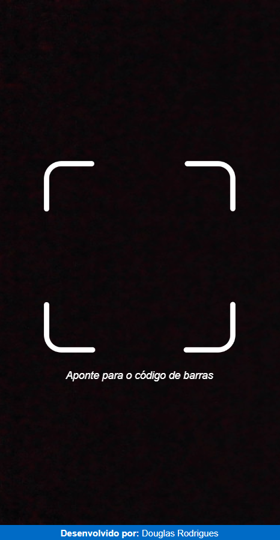

<h1 align="center">
    React Barcode Reader
</h1>

## 💻 Sobre o projeto

Projeto desenvolvido para praticar React e Typescript.

---

## 🛠 Tecnologias/Ferramentas

As seguintes ferramentas foram usadas na construção do projeto:

- React
- TypeScript
- Styled Components
- QuaggaJS
- React Barcode
- Sweet Alert 2
- Sweet Alert React Content

---
## 🚀 Projeto

<h1 align="center">
    
</h1>
<h4 align="center">
  Você pode conferir o projeto aqui: <a href="https://douglasrodr-react-barcode-reader.netlify.app" target="_blank">Demo</a>
</h4>

---

## 🦸 Autor

Desenvolvido por Douglas Rodrigues 👋🏽 [Entre em contato!](https://www.linkedin.com/in/douglas-rodrigues-pnz/)
